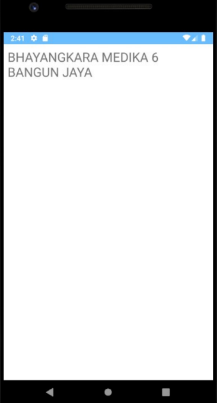

# IF3210-2022-Android-13

Tubes 1 PBD

# Deskripsi Aplikasi
Aplikasi Perlu Dilindungi adalah aplikasi yang menampilkan berita COVID-19, menampilkan daftar faskes terdekat dengan pengguna untuk faksinasi, menampilkan detail faskes vaksinasi, menambahkan faskes ke bookmark, serta dapat menampilkan daftar bookmark faskes.

# Cara Kerja
Buka aplikasi, lalu untuk melihat berita klik ke salah satu judul.  
Untuk mencari faskes, tekan cari faskes lalu pilih provinsi dan kota faskes.  
Klik nama faskes untuk melihat detail faskes.  
Setelah detail faskes ditampilkan, klik tombol Map untuk menampilkan lokasi faskes pada peta, dan Bookmark untuk menambahkan faskes ke Bookmark.  
Untuk membatalkan Bookmark, tekan tombol Unbookmark.  
Untuk melihat list Bookmark, kembali ke menu utama lalu tekan tombol Go To Bookmark.  

# Library
Retrofit: REST Client

# Screenshot
  
  
  
  
  
  

# Anggota - Bagian yang Dikerjakan
13519047 Rhea Elka Pandumpi - News, WebView, Cari Faskes, Detail Faskes, Map Faskes, Bookmark/Unbookmark, List Bookmark  
13517136 Lucky Jonathan Chandra -  
13518021 Zaidan Naufal Sudrajat -  